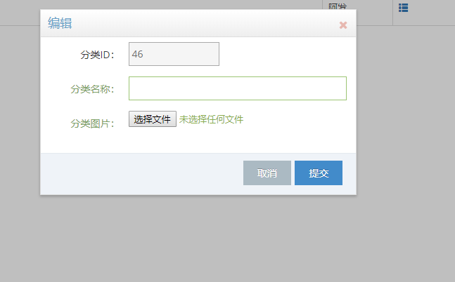

# 项目描述
本项目分为两个模块：前台购物模块和后台管理模块。目前已完成后台管理模块。  
后台管理模块的页面使用了 [ace-admin](http://ace.jeka.by/index.html) 模板, 后台使用 SSM(Spring MVC + Spring + Mybatis) 框架
# 更新日志：
* 2018-04-13
后台加入权限验证，经过考虑后台未提供注册功能

* 2018-04-08
 完成后台管理模块
 
# 项目概览
## 后台管理模块
1. 登录界面  
      
2. 详情界面  
      
3. 添加界面
     
4. 编辑界面
    
5. 删除界面
    